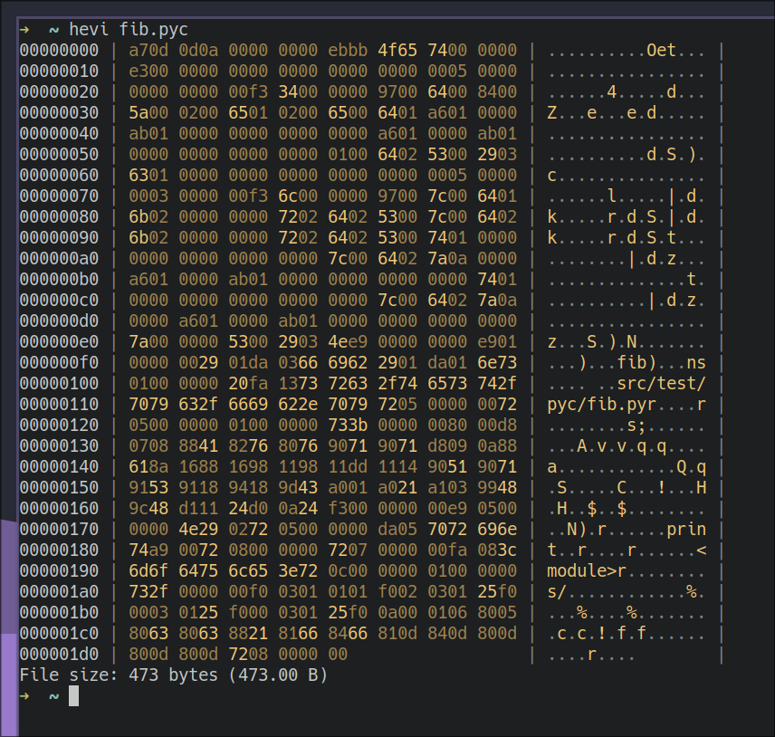

# HEVI - A hex viewer

## What is hevi?
Hevi is a hex viewer, just like `xxd` or `hexdump`.

## But it's missing X...
Hevi is under development. But if you think it's missing any feature, please open an issue. I will address it as soon as possible.

## Usage
The command should be used as `hevi <file> [flags]`. The flags are described [below](#flags).

### Flags
| Flag(s)                     | Description                                             |
| --------------------------- | ------------------------------------------------------- |
| `-h`/`--help`               | Show a help message                                     |
| `-v`/`--version`            | Show version information                                |
| `--color`/`--no-color`      | Enable and disable colored output                       |
| `--lowercase`/`--uppercase` | Toggle between lowercase and uppercase hex              |
| `--size`/`--no-size`        | Enable and disable the line showing the size at the end |
| `--offset`/`--no-offset`    | Enable and disable showing the offset                   |
| `--acii`/`--no-ascii`       | Enable and disable ASCII interpretation                 |

### Environment variables
The `NO_COLOR` variable is supported, and disables color (see <https://no-color.org/>) printing. Note that it can be overwritten by an explicit `--color`.

## About
It is written in [zig](https://github.com/ziglang/zig), in an attempt to simplify hex viewers.

## Installation
### AUR
If you're using Arch Linux, you can install it from the AUR (`hevi-bin`).
### Other platforms
You can download a binary from the [releases](https://github.com/Arnau478/hevi/releases/) page. You can also clone the repository and compile it with `zig build` (using a `zig` master build).

## Contribute
Contributions are welcome! Even if you don't want to write code, you can help a lot creating new issues or testing this software.

## License
See [LICENSE](LICENSE)

