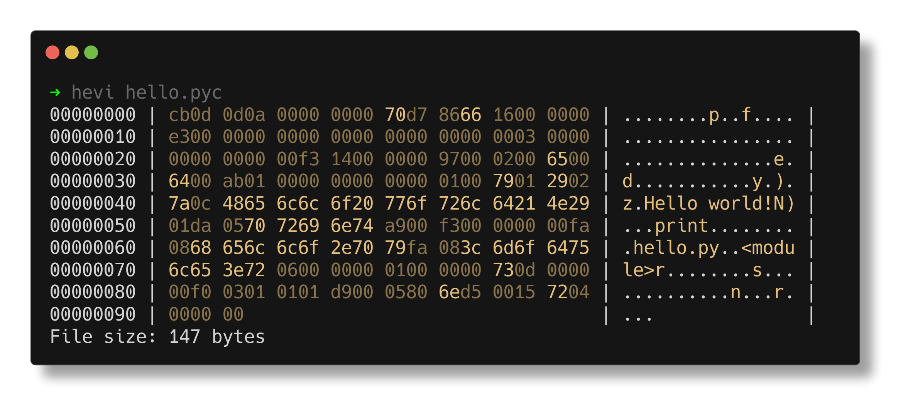

<div align="center">
    <h1 align="center">hevi</h1>
    <h3>a hex viewer</h3>
</div>




## What is hevi?
Hevi is a hex viewer, just like `xxd` or `hexdump`.

## But it's missing X...
Hevi is under development. But if you think it's missing any feature, please open an issue. I will address it as soon as possible.

## Usage
The command should be used as `hevi <file> [flags]`. The flags are described [below](#flags).

### Flags
| Flag(s)                          | Description                                             |
| -------------------------------- | ------------------------------------------------------- |
| `-h`/`--help`                    | Show a help message                                     |
| `-v`/`--version`                 | Show version information                                |
| `--color`/`--no-color`           | Enable or disable colored output                        |
| `--lowercase`/`--uppercase`      | Toggle between lowercase and uppercase hex              |
| `--size`/`--no-size`             | Enable or disable the line showing the size at the end  |
| `--offset`/`--no-offset`         | Enable or disable showing the offset                    |
| `--ascii`/`--no-ascii`           | Enable or disable ASCII interpretation                  |
| `--skip-lines`/`--no-skip-lines` | Enable or disable skipping of identical lines           |
| `--raw`                          | Raw format (disables most features)                     |
| `--show-palette`                 | Show the current color palette in a table               |
| `--parser`                       | Specify the parser to use. For a list use `hevi --help` |

### Environment variables
The `NO_COLOR` variable is supported, and disables color (see <https://no-color.org/>) printing. Note that it can be overwritten by an explicit `--color`.

### Config file
The config file is a [ziggy](ziggy-lang.io) file. The following fields are
available:
```zig
color: bool,
uppercase: bool,
show_size: bool,
show_offset: bool,
show_ascii: bool,
skip_lines: bool,
raw: bool,
palette: Palette,
```

All fields are optional.

**Note**: for the `palette` field you must specify all styles!

#### Example config
```zig
.color = true,
.skip_lines = false,
.palette = Palette{
    .normal = @color("yellow"),
    .normal_alt = @color("yellow::dim"),
    .normal_accent = @color("yellow:bright_black:bold"),
    .c1 = @color("red"),
    .c1_alt = @color("red::dim"),
    .c1_accent = @color("red:bright_black:bold"),
    .c2 = @color("green"),
    .c2_alt = @color("green::dim"),
    .c2_accent = @color("green:bright_black:bold"),
    .c3 = @color("blue"),
    .c3_alt = @color("blue::dim"),
    .c3_accent = @color("blue:bright_black:bold"),
    .c4 = @color("cyan"),
    .c4_alt = @color("cyan::dim"),
    .c4_accent = @color("cyan:bright_black:bold"),
    .c5 = @color("magenta"),
    .c5_alt = @color("magenta::dim"),
    .c5_accent = @color("magenta:bright_black:bold"),
},
```

#### Location

The config file is located at:
| OS                                     | Path                                                                                             |
| -------------------------------------- | ------------------------------------------------------------------------------------------------ |
| Linux, MacOS, FreeBSD, OpenBSD, NetBSD | `$XDG_CONFIG_HOME/hevi/config.ziggy` or if the env doesn't exist `$HOME/.config/hevi/config.ziggy` |
| Windows                                | `%APPDATA%/hevi/config.ziggy`                                                                     |
| Other                                  | Not supported. No config file will be read                                                       |

#### Precedence
Hevi has a precedence for configuration and it is:
1. Flags
2. Environment variables
3. Config file
4. Defaults

## About
It is written in [zig](https://github.com/ziglang/zig), in an attempt to simplify hex viewers.

## Installation
### AUR
If you're using Arch Linux, you can install it from the AUR (`hevi-bin`).
### Other platforms
You can download a binary from the [releases](https://github.com/Arnau478/hevi/releases/) page. You can also clone the repository and compile it with `zig build` (using a `zig` master build).

## Contribute
Contributions are welcome! Even if you don't want to write code, you can help a lot creating new issues or testing this software.

## License
See [LICENSE](LICENSE)

[](https://www.gnu.org/licenses/gpl-3.0)
